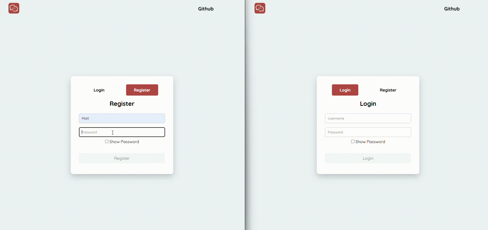

<p align="center">
  
</p>

<h1 align="center">Connecto</h1>

<h3 align="center">A real-time chat application built with Node.js, Express, Socket.IO, and JWT authentication. Users can register, connect with other users, and exchange messages instantly through a web interface.</h3>

<p align="center">
  
  
  
  
</p>

## 🖼️ Preview

<p align="center">
  
</p>

## ✨ Features

- 🔐 User authentication (Login/Register)
- ⚡ Real-time messaging
- 🔒 Secure password handling
- 🟢 Online/offline status indicators

## 🛠️ Tech Stack

### 🎨 Frontend

- HTML
- CSS
- JavaScript

### ⚙️ Backend

- Node.js
- Express.js

### 📁 Database

- Uses a JSON file as a lightweight storage solution suitable for small-scale applications and learning purposes.

### 🧰 Other Tools

- Socket.IO
- JWT Authentication
- Bcrypt
- Multer

## 📸 Screenshots

### 🔑 Login/Register Page

<p align="center">
  
</p>

<p align="center">
  
</p>

### 💬 Chat Interface

<p align="center">
  
</p>

<p align="center">
  
</p>

<p align="center">
  
</p>

## 📂 Project Structure

```text
📁 connecto/
    ├── 📁 controllers/
    │   ├── 🟨 authController.js
    │   ├── 🟨 messageController.js
    │   └── 🟨 userController.js
    ├── 📁 data/
    │   ├── 📁 uploads/
    │   │   └── 📄 .gitkeep
    │   ├── 🔢 credentials.json
    │   └── 🔢 messagesDB.json
    ├── 📁 middleware/
    │   ├── 🟨 authMiddleware.js
    │   └── 🟨 multerMiddleware.js
    ├── 📁 public/
    │   ├── 📁 auth/
    │   │   ├── 📁 img/
    │   │   │   └── 🖼️ logo.svg
    │   │   ├── 📁 js/
    │   │   │   ├── 🟨 api.js
    │   │   │   ├── 🟨 eventListeners.js
    │   │   │   ├── 🟨 handleAuth.js
    │   │   │   ├── 🟨 main.js
    │   │   │   └── 🟨 state.js
    │   │   ├── 📄 index.html
    │   │   └── 🎨 style.css
    │   └── 📁 home/
    │       ├── 📁 img/
    │       │   ├── 🖼️ chatBackground.svg
    │       │   ├── 🖼️ logo.svg
    │       │   └── 🖼️ userProfile.svg
    │       ├── 📁 js/
    │       │   ├── 🟨 api.js
    │       │   ├── 🟨 auth.js
    │       │   ├── 🟨 chat.js
    │       │   ├── 🟨 eventListeners.js
    │       │   ├── 🟨 main.js
    │       │   ├── 🟨 socket.js
    │       │   ├── 🟨 state.js
    │       │   └── 🟨 users.js
    │       ├── 📄 index.html
    │       └── 🎨 style.css
    ├── 📁 routes/
    │   ├── 🟨 auth.js
    │   ├── 🟨 messages.js
    │   └── 🟨 user.js
    ├── 📁 screenshots/
    │   ├── 🖼️ chat1.png
    │   ├── 🖼️ chat2.png
    │   ├── 🖼️ home.png
    │   ├── 🖼️ login.png
    │   └── 🖼️ register.png
    ├── 📁 utils/
    │   └── 🟨 fileHandler.js
    ├── ⚙️ .env
    ├── ⚙️ .env.example
    ├── 📄 .gitignore
    ├── 🔢 package-lock.json
    ├── 🔢 package.json
    ├── 📄 README.md
    ├── 🟨 server.js
    └── 🟨 socketServer.js
```

## 🧠 Key Learnings

1. Real-time communication using Socket.IO
2. Authentication using JWT
3. Password hashing with Bcrypt
4. File uploads with Multer
5. Backend development with Express.js

## 📝 Note

- The maximum file size for uploads is **40 MB**.
- Only the following file types are supported:
  1.  🖼️ Images
      - PNG: .png
      - JPEG / JPG: .jpeg, .jpg
      - WebP: .webp
      - GIF: .gif
      - SVG: .svg
      - ICO (Icon): .ico

  2.  🎥 Videos
      - MP4: .mp4
      - MPEG: .mpeg, .mpg
      - WebM: .webm
      - Matroska: .mkv

  3.  🎵 Audio
      - AAC: .aac
      - WebM Audio: .weba
      - MP3: .mp3
      - Ogg Audio: .ogg, .oga
      - MP4 Audio: .m4a

  4.  💻 Text & Code
      - Plain Text: .txt
      - CSV: .csv
      - CSS: .css
      - HTML: .html, .htm
      - JavaScript: .js
      - Markdown: .md
      - XML: .xml
      - JSON: .json

  5.  📊 Documents & Presentations
      - PDF: .pdf
      - Word Document: .docx, .doc
      - Excel Spreadsheet: .xlsx, .xls
      - PowerPoint Presentation: .pptx, .ppt

  6.  📦 Archives & Binary
      - ZIP Archive: .zip
      - 7-Zip Archive: .7z
      - RAR Archive: .rar
      - Octet-Stream (Binary Data): .bin (or generic unstructured file data)

## 🚀 Installation

1. Clone the repository

```bash
git clone <repo-url>
```

### 📋 Example

```bash
git clone https://github.com/Spufyyffett/connecto.git
```

2. Navigate to the project folder

```bash
cd connecto
```

3. Install dependencies

```bash
npm install
```

4. Create a .env file and add this string in it (refer .env.example)

```env
JWT_SECRET="your_secret_key"
```

5. Start the application

```bash
npm start
```

or

```bash
npm run dev
```

## 💻 Usage

1. Register a new account.
2. Login using your credentials.
3. Search for other users.
4. If running locally, create multiple accounts for testing conversations.
5. Start exchanging messages in real time.

## ⚠️ Disclaimer

This project is intended strictly for **educational and learning purposes**. It has not been audited for security and likely contains vulnerabilities. **Do not deploy this in production or use it for real-world applications.**

## 🔮 Future Improvements

- 🎙️ Voice messages
- 📹 Video calling
- ❤️ Message reactions
- 🗑️ Message deletion
- 🔒 End-to-end encryption

## 👤 Author

Deon

## 📄 License

MIT License
