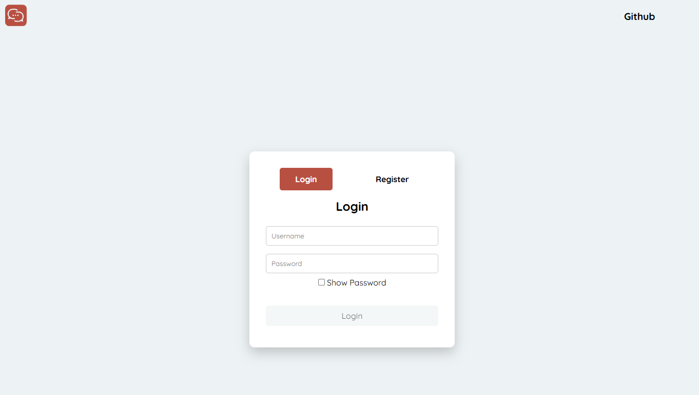
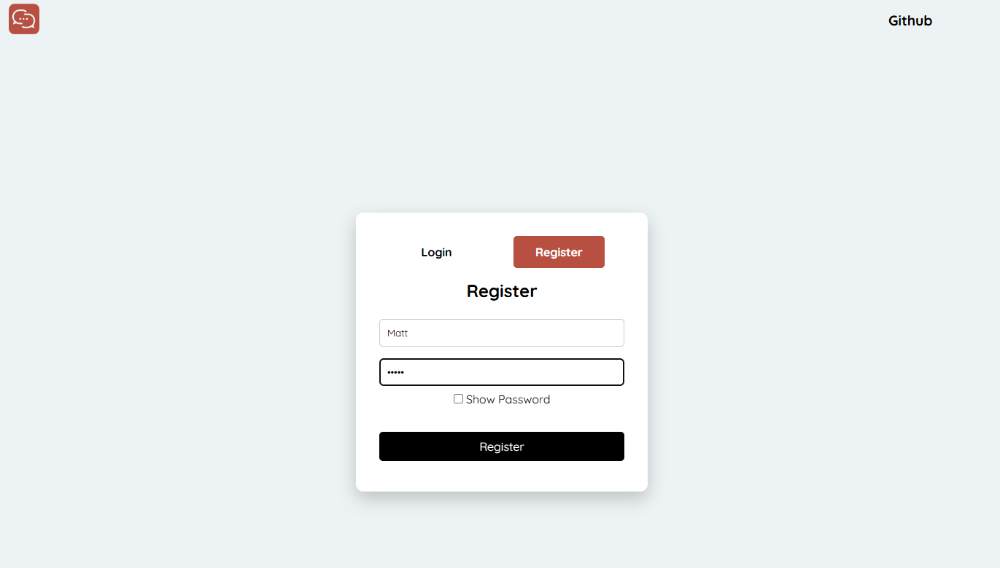
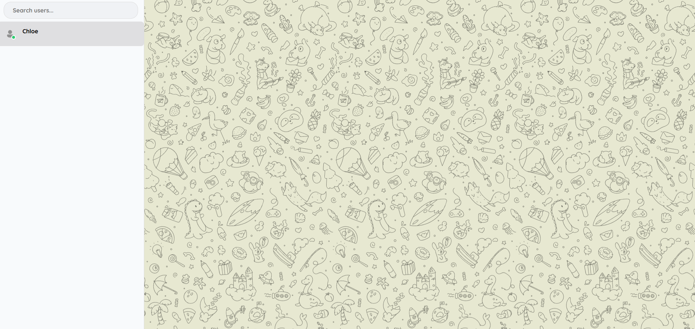
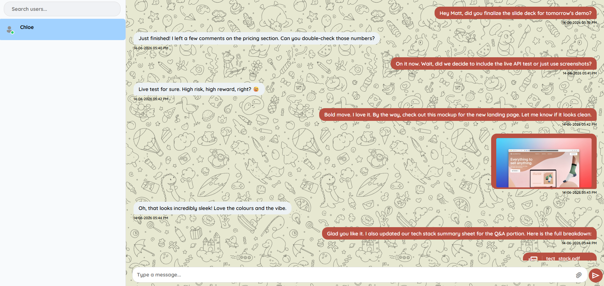
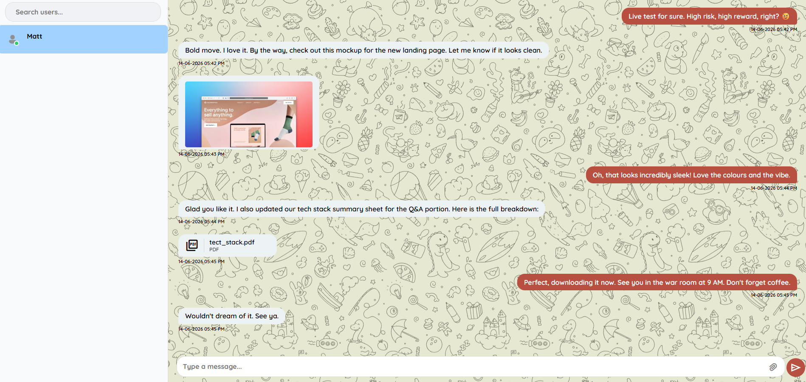

# ChatApp

A real-time chat application built with Node.js, Express, Socket.IO, and JWT authentication. Users can register, connect with other users, and exchange messages instantly through a web interface.

## Features

- User authentication (Login/Register)
- Real-time messaging
- Secure password handling
- Online/offline status indicators

## Tech Stack

### Frontend

- HTML
- CSS
- JavaScript

### Backend

- Node.js
- Express.js

### Database

- Uses a JSON file as a lightweight storage solution suitable for small-scale applications and learning purposes.

### Other Tools

- Socket.IO
- JWT Authentication
- Bcrypt
- Multer

## Screenshots

### Login/Register Page





### Chat Interface







## Project Structure

```text
📁 connecto/
    ├── 📁 controllers/
    │   ├── 🟨 authController.js
    │   ├── 🟨 messageController.js
    │   └── 🟨 userController.js
    ├── 📁 data/
    │   ├── 📁 uploads/
    │   │   └── 📄 .gitkeep
    │   ├── 🔢 credentials.json
    │   └── 🔢 messagesDB.json
    ├── 📁 middleware/
    │   ├── 🟨 authMiddleware.js
    │   └── 🟨 multerMiddleware.js
    ├── 📁 public/
    │   ├── 📁 auth/
    │   │   ├── 📁 img/
    │   │   │   └── 🖼️ logo.svg
    │   │   ├── 📁 js/
    │   │   │   ├── 🟨 api.js
    │   │   │   ├── 🟨 eventListeners.js
    │   │   │   ├── 🟨 handleAuth.js
    │   │   │   ├── 🟨 main.js
    │   │   │   └── 🟨 state.js
    │   │   ├── 📄 index.html
    │   │   └── 🎨 style.css
    │   └── 📁 home/
    │       ├── 📁 img/
    │       │   ├── 🖼️ chatBackground.svg
    │       │   ├── 🖼️ logo.svg
    │       │   └── 🖼️ userProfile.svg
    │       ├── 📁 js/
    │       │   ├── 🟨 api.js
    │       │   ├── 🟨 auth.js
    │       │   ├── 🟨 chat.js
    │       │   ├── 🟨 eventListeners.js
    │       │   ├── 🟨 main.js
    │       │   ├── 🟨 socket.js
    │       │   ├── 🟨 state.js
    │       │   └── 🟨 users.js
    │       ├── 📄 index.html
    │       └── 🎨 style.css
    ├── 📁 routes/
    │   ├── 🟨 auth.js
    │   ├── 🟨 messages.js
    │   └── 🟨 user.js
    ├── 📁 screenshots/
    │   ├── 🖼️ chat1.png
    │   ├── 🖼️ chat2.png
    │   ├── 🖼️ home.png
    │   ├── 🖼️ login.png
    │   └── 🖼️ register.png
    ├── 📁 utils/
    │   └── 🟨 fileHandler.js
    ├── ⚙️ .env
    ├── ⚙️ .env.example
    ├── 📄 .gitignore
    ├── 🔢 package-lock.json
    ├── 🔢 package.json
    ├── 📄 README.md
    ├── 🟨 server.js
    └── 🟨 socketServer.js

```

## Key Learnings

- Real-time communication using Socket.IO
- Authentication using JWT
- Password hashing with Bcrypt
- File uploads with Multer
- Backend development with Express.js

## Note

- The maximum file size for uploads is **40 MB**.
- Only the following file types are supported:
  1. **Images**
     - PNG
     - JPEG (.jpeg, .jpg)

  2. **Videos**
     - MP4
     - MPEG
     - WebM
     - MKV (Matroska)

  3. **Audio**
     - MP3
     - MPEG Audio
     - OGG

  4. **Documents**
     - PDF
     - Microsoft Word (.doc, .docx)

  5. **Compressed Files**
     - ZIP
     - RAR
     - 7Z

## Installation

1. Clone the repository

```bash
git clone <repo-url>
```

### Example

```bash
git clone https://github.com/Spufyyffett/connecto.git
```

2. Navigate to the project folder

```bash
cd connecto
```

3. Install dependencies

```bash
npm install
```

4. Create a .env file and add this string in it

```env
JWT_SECRET="your_secret_key"
```

5. Start the application

```bash
npm start
```

## Usage

1. Register a new account.
2. Login using your credentials.
3. Search for other users.
4. If running locally, create multiple accounts for testing conversations.
5. Start exchanging messages in real time.

## Future Improvements

- Voice messages
- Video calling
- Message reactions
- Message deletion
- End-to-end encryption

## Author

Deon

## License

MIT License
